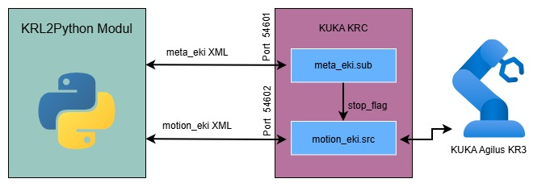
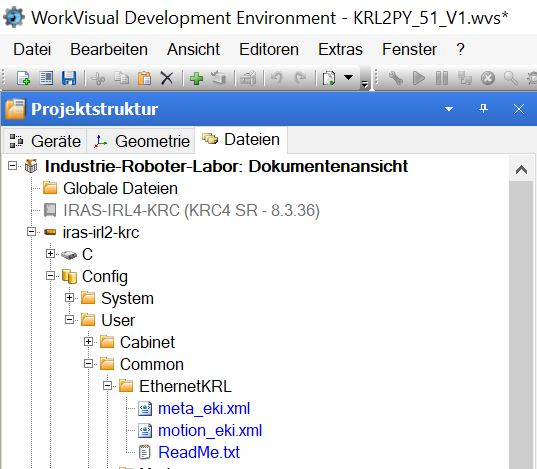
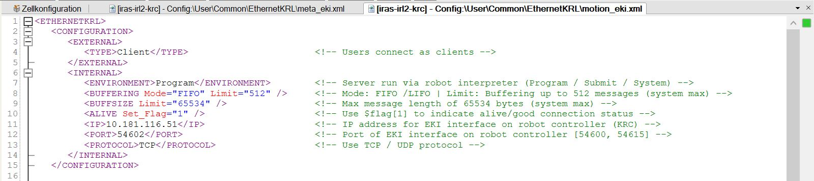
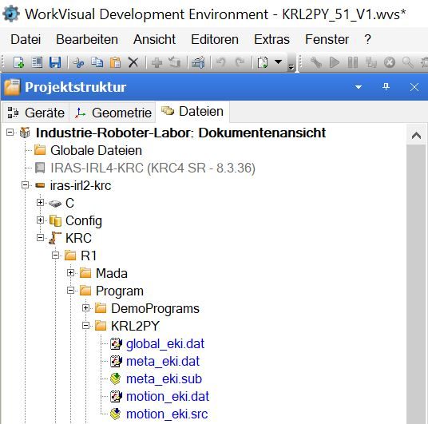
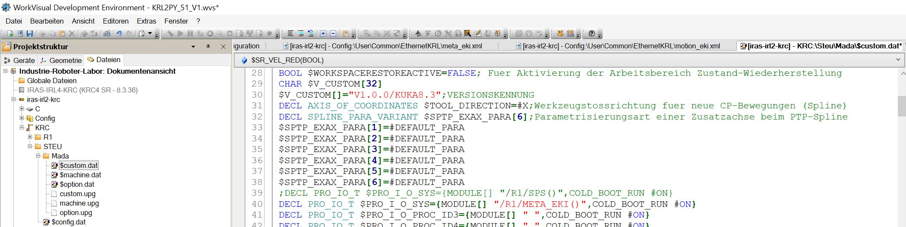

# Tutorial to set up KUKA KR3 for 2526ws_BH_KRL2Python

> [!NOTE]
> Das Repository ist für einen KR3 R540 vorkonfiguriert und kann durch Anpassung von IP-Adressen, Ports und Punktdaten auf andere Setups übertragen werden.

## Interaktion Python / EKI / KUKA
Ein externes Programm, geschrieben in der **Programmiersprache Python**, wird verwendet, um Befehle an die **KUKA Robot Control (KRC)** zu senden und Bewegungen des Roboters zu steuern.
Die Kommunikation zwischen dem Python-Programm und der KRC erfolgt über das **Ethernet KRL Interface (EKI)**. Dabei werden XML-Nachrichten über TCP/IP zwischen dem externen Rechner und der Robotersteuerung ausgetauscht.

Das Python-Programm sendet Bewegungs- und Steuerbefehle an die KRC, welche diese über zwei getrennte Interpreter verarbeitet.
- **Roboterprogramm (Motion Interpreter)**  
  → verarbeitet eingehende **Bewegungsbefehle** (z. B. PTP oder LIN) und führt diese am Roboter aus.

- **Submit Interpreter (Meta / Hintergrundprogramm)**  
  → läuft parallel im Hintergrund und verarbeitet **Steuerbefehle** wie z. B. Override oder Stop.
	
<p align="left">
  
</p>

---

## Einrichtung – KUKA Robot Controller (KRC)
In diesem Abschnitt wird die Installation und Konfiguration des Projekts auf der KUKA-Steuerung beschrieben.
Teile der Beschreibung des Vorgehens wurden aus folgendem Repo adaptiert bzw. modifiziert: https://github.com/b-robotized-forks/kuka_experimental/blob/motion_primitive_kuka_driver/kuka_eki_motion_primitives_hw_interface/krl/README.md


### 1. Kuka Steuerung hochfahren
### 2. PC hochfahren und mit RZ-Benutzer anmelden
### 3. KRL Dateien aus dem Repo herunterladen 
### 4. Neues Workvisual Projekt am Smartpad erstellen
>⚠️ Benutzergruppe Experte notwendig
- Hauptmenü Softkey (Smartpad Robotersymbol unten rechts) drücken
- im Menü: Konfiguration → Benutzergruppe → Experte → Pw: kuka

### 5. Einfügen und Anpassen der Konfigurationsdateien (meta.xml, motion.xml) in das WorkVisual Projekt


- 📄 [meta.xml](KRL/meta_eki.xml)  
- 📄 [motion_eki.xml](KRL/motion_eki.xml)

<p align="left">
  
</p>


In der EKI-Konfiguration(`<CONFIGURATION> </CONFIGURATION>`) müssen folgende Parameter jeweils für die Motion-Kommunikation und die Meta-Kommunikation überprüft und ggf. angepasst werden:
- **IP-Adresse des externen Rechners (Python-PC)**
- **Portnummer**

<p align="left">
  
</p>

> ⚠️ Diese Werte müssen exakt mit den Einstellungen im Python-Projekt übereinstimmen.

### 5. Einfügen und Anpassen weiterer Dateien in das WorkVisual Projekt
Es müssen folgende Dateien in das abgebildete Verzeichnis kopiert werden.
- 📄 [global_eki.dat](KRL/global_eki.dat)  
- 📄 [meta_eki.dat](KRL/meta_eki.dat)  
- 📄 [meta_eki.sub](KRL/meta_eki.sub)  
- 📄 [motion_eki.dat](KRL/motion_eki.dat)  
- 📄 [motion_eki.src](KRL/motion_eki.src)  

<p align="left">
  
</p>

Zusätzlich muss in der Datei `custom.dat` der Eintrag `/R1/SPS()` durch `/R1/Meta_EKI()` ersetzt werden.

<p align="left">
  
</p>

## Einrichtung – Python Umgebung

---

## Voraussetzungen
- Python 3.10 oder neuer (z. B. Python 3.13.7 unter Linux)
- Optional: Conda (Miniconda oder Anaconda)
- Netzwerkzugriff auf den KUKA Controller
- GUI/OpenGL-Unterstützung (für PyBullet)

---

### 1. Repository klonen
```bash
git clone <repository-url>
cd <repository-name>
```

### 2. Virtuelle Umgebung erstellen (empfohlen)

Option A: Standard Python `venv` (ohne Conda)
```bash
python3 -m venv .venv
source .venv/bin/activate
python -m pip install --upgrade pip
```

Option B: Conda (optional)
```bash
conda create -n kuka_env python=3.10
conda activate kuka_env
python -m pip install --upgrade pip
```

### 3. Abhängigkeiten installieren
```bash
python -m pip install -r requirements.txt
```

### 4. PyBullet Installation überprüfen
```bash
python -c "import pybullet as p; p.connect(p.GUI); import time; time.sleep(3); p.disconnect()"
```
#### Erwartetes Verhalten
- Es öffnet sich ein PyBullet-Fenster
- Das Fenster bleibt für ca. 3 Sekunden sichtbar
- Danach schließt es sich automatisch

#### Fehlerbehebung
1. Falls kein Fenster erscheint oder ein Fehler auftritt:
- Prüfen, ob PyBullet installiert ist:
```bash
pip show pybullet
```
2. Sicherstellen, dass eine grafische Oberfläche verfügbar ist
- Typische Fehler:
	- cannot connect to X server → keine GUI verfügbar
	- Fenster öffnet sich nicht → OpenGL / Grafiktreiber prüfen
---

## Einrichtung - Netzwerkkonfiguration
Vor dem ersten Start müssen die Verbindungsparameter zum Roboter überprüft und ggf. angepasst werden.

### 1. Relevante Dateien
Überprüfe die Verbindungseinstellungen in folgenden Dateien:
- `src/Main.py`
- `scripts/example_script.py`

### 2. Standardwerte im Projekt
Dieses Projekt verwendet standardmäßig folgende Konfiguration:
- KUKA_IP: `10.181.116.51`
- KUKA_PORT_META: `54601`
- KUKA_PORT_MOTION: `54602`

### 3. Anpassung der Parameter
Falls dein Roboter oder Netzwerk davon abweicht, müssen IP-Adresse und Ports entsprechend angepasst werden.
In den oben genannten Dateien:

```python
KUKA_IP = "10.xxx.xxx.xxx"
KUKA_PORT_META = XXXX
KUKA_MOTION_PORT = XXXX
```
- **KUKA_IP** → IP-Adresse des KUKA Controllers
- **KUKA_PORT_META** → Port für Meta-Kommunikation
- **KUKA_MOTION_PORT** → Port für Motion-Kommunikation/ Bewegungsbefehle

> ⚠️ Die Portnummern müssen mit der Konfiguration auf der KUKA-Seite übereinstimmen.

### 4. IP-Konfiguration im Roboternetzwerk
Damit die Kommunikation funktioniert, müssen sich **Roboter und Laptop im selben Netzwerk (Subnetz)** befinden.
- Der Roboter besitzt eine feste IP-Adresse (z. B. `10.181.116.51`)
- Der Laptop muss eine freie IP-Adresse im gleichen Netzwerk erhalten

#### Beispiel:

| Gerät    | IP-Adresse        |
|----------|------------------|
| Roboter  | 10.181.116.51    |
| Laptop   | 10.181.116.100   |

> ⚠️ Wichtig:
> - Die ersten drei Blöcke müssen identisch sein (z. B. `10.181.116.xxx` bei Subnetzmaske 255.255.255.0)
> - Die gewählte IP darf noch nicht im Netzwerk verwendet werden

### 5. Verbindung testen
Um sicherzustellen, dass die Netzwerkverbindung zum Roboter funktioniert, kann dieser vorab angepingt werden:
```bash
ping 10.181.116.51
```

### 6. Erwartetes Ergebnis
- Der Roboter antwortet auf die Anfrage
- Keine Paketverluste

Beispiel:
```bash
64 bytes from 10.181.116.51: icmp_seq=1 ttl=64 time=0.5 ms
```

### Hinweis
- Wenn keine Antwort kommt:
  - IP-Adresse überprüfen
  - Laptop im richtigen Netzwerk?
  - Freie IP-Adresse gewählt?
  - Netzwerkkabel verbunden?

> ⚠️ Der Ping-Test bestätigt nur die grundlegende Netzwerkverbindung.
> Für die Steuerung müssen zusätzlich die richtigen Ports gesetzt und die EKI-Schnittstelle auf dem Roboter aktiv sein.

---

## Funktionsumfang
Nach erfolgreicher Installation und Einrichtung ermöglicht das Python-Paket die vollständige Steuerung eines KUKA-Roboters über die EthernetKRL-Schnittstelle.
Dabei stehen folgende Funktionen zur Verfügung:
- **Bewegungsbefehle**
	- Punkt-zu-Punkt (PTP) in kartesischen Koordinaten
	- Punkt-zu-Punkt in Gelenkkoordinaten (PTP Joint)
	- Linearbewegungen (LIN)
	- Kreisbewegungen (CIRC)
	- Ausführung von Bewegungssequenzen aus CSV-Dateien

- **Greifersteuerung**
	- Öffnen und Schließen des Greifers über digitale Signale

- **Systemsteuerung**
	- Setzen des Velocity-Override (Geschwindigkeit in %)
	- Abbruch laufender Bewegungen (Abort)

- **Punktverwaltung**
	- Speichern von Roboterpositionen (Touchup)
	- Laden und Wiederverwenden gespeicherter Punkte
	- Organisation von Sequenzen über CSV-Dateien

- **Visualisierung**
	- Darstellung der aktuellen Gelenkzustände des Roboters in PyBullet


- **Zwei Nutzungsarten**
	- **Interaktiv** über eine Konsolenoberfläche (CLI)
	- **Programmgesteuert über eigene Python-Skripte** mittels der Robot-Klasse
   
### Motion-Modi (aus `motion_eki.xml`, `RobotCommand/Move/@Mode`)
Verfügbare Move-Modi **1–6**:

- **1** = Joint
- **2** = Cartesian-PTP
- **3** = Cartesian-LIN
- **4** = Teached-PTP
- **5** = Teached-LIN
- **6** = Cartesian-CIRC

---

## Repository Layout

- `src/`
  	Enthält den gesamten Python-Quellcode der Anwendung:
	- `Main.py` — Einstiegspunkt für die interaktive Anwendung (Konsolensteuerung)
	- `command.py` — Implementierung der CLI und Benutzerinteraktion
	- `robot.py` — Zentrale Klasse, die Motion- und Meta-Controller zusammenführt
	- `motion_controller.py` — Bewegungs- und Greiferbefehle sowie PyBullet-Visualisierung
	- `meta_controller.py` — Steuerbefehle wie Override und Abort
	- `transport.py` — TCP-Kommunikation mit der KUKA-Steuerung
	- `csvHelper.py` — Funktionen zum Lesen und Schreiben von CSV-Dateien
	- `point.py` — Datenstrukturen (`Point6D`, `JointState`) für Roboterzustände
- `database/`
  	Enthält gespeicherte Roboterpunkte:
	- `points.csv` — Benannte Zielpunkte (z.B. von Touchup)
	- `sequence_points.csv` — Punkte für Bewegungsseque	nzen
- `kuka_kr3_support/`
  	Beinhaltet URDF-Dateien und Meshes zur Visualisierung des KR3-Roboters in PyBullet
- `scripts/`
	Beispielskripte zur direkten Nutzung der Robot-Klasse ohne Konsolenoberfläche

---

## Systemarchitektur
Die Software ist modular aufgebaut und folgt einer klaren Trennung der Verantwortlichkeiten. Ziel dieser Architektur ist es, die Benutzerinteraktion, die Roboterlogik und die Netzwerkkommunikation voneinander zu entkoppeln. Dadurch wird das System übersichtlich, erweiterbar und sowohl für interaktive Nutzung als auch für automatisierte Abläufe geeignet.

### 1. Anwendung
Die oberste Schicht bildet die Klasse `Command`. Sie stellt die Schnittstelle zum Benutzer dar und implementiert eine textbasierte Menüführung im Terminal. Hier werden alle Benutzereingaben verarbeitet und in konkrete Roboterbefehle übersetzt.

`Command` selbst enthält keine Logik zur Robotersteuerung, sondern fungiert ausschließlich als Vermittler. Je nach Auswahl im Menü werden Methoden der darunterliegenden Robot-Klasse aufgerufen. Zusätzlich verwaltet diese Schicht Zustände wie den aktuellen Bedienmodus (`CommandMode`) sowie Hilfsstrukturen für Eingaben und Punktverwaltung.

### 2. Logik
Die zentrale Komponente dieser Schicht ist die Klasse `Robot`. Sie stellt die Hauptschnittstelle für alle Roboterfunktionen dar und bündelt die Funktionalität der beiden Controller:
- `MotionController` für Bewegungs- und Greiferbefehle
- `MetaController` für übergeordnete Steuerbefehle wie Override oder Abort

Diese Trennung ist bewusst gewählt: Bewegungsbefehle und Systemsteuerbefehle werden unabhängig voneinander behandelt, obwohl sie technisch über ähnliche Kommunikationsmechanismen laufen.
Die Klasse `Robot` abstrahiert diese Aufteilung vollständig. Für den Benutzer (oder ein externes Skript) wirkt sie wie eine einheitliche API, obwohl intern mehrere spezialisierte Komponenten zusammenarbeiten.

Zusätzlich werden in dieser Schicht Datenstrukturen wie `Point6D` und `JointState` verwendet, um Roboterzustände und Zielpositionen standardisiert abzubilden. Dadurch entsteht eine klare Trennung zwischen Datenrepräsentation und Kommunikationslogik.

### 3. Kommunikation
Die unterste Schicht bildet die Netzwerkkommunikation mit der KUKA-Steuerung. Diese wird durch die Klasse `TcpTransport` kapselt.
Jeder Controller verwendet eine eigene Instanz dieser Klasse:
- eine Verbindung für Bewegungsdaten (Motion-Kanal)
- eine Verbindung für Steuerbefehle (Meta-Kanal)

Diese Trennung entspricht der Struktur auf der KUKA-Seite (EKI) und ermöglicht eine parallele und unabhängige Verarbeitung von Bewegungs- und Steuerbefehlen.
`TcpTransport` übernimmt dabei ausschließlich technische Aufgaben wie:
- Aufbau und Abbau der Verbindung
- Senden von XML-Nachrichten
- Empfangen von Statusdaten


### 4. Zusammenspiel der Schichten
Der typische Ablauf innerhalb des Systems ist klar hierarchisch aufgebaut:
1. Der Benutzer gibt einen Befehl im Terminal ein (Command).
2. Command übersetzt diese Eingabe in einen Methodenaufruf auf Robot.
3. Robot delegiert den Aufruf an den passenden Controller (MotionController oder MetaController).
4. Der jeweilige Controller erzeugt ein XML-Kommando entsprechend der KUKA-EKI-Spezifikation.
5. Das Kommando wird über TcpTransport an die Robotersteuerung gesendet.

Rückmeldungen der Steuerung werden in umgekehrter Richtung verarbeitet und können zur Aktualisierung von Zuständen oder zur Visualisierung verwendet werden.

> ⚠️ **Wichtig**: Die Klasse `Command` ist optional und nicht zwingend Bestandteil des Systems. Sie dient ausschließlich der interaktiven Bedienung über das Terminal.

Alternativ kann die Steuerung vollständig ohne Command erfolgen, indem ein eigenes Python-Skript direkt mit der Klasse Robot arbeitet. In diesem Fall entfällt die gesamte Anwendungsschicht, und die Befehle werden programmgesteuert ausgeführt:
1. Ein eigenes Skript ruft direkt Methoden der Klasse `Robot` auf.
2. `Robot` delegiert die Befehle wie gewohnt an die jeweiligen Controller.
3. Die Kommunikation mit der KUKA-Steuerung erfolgt unverändert über `TcpTransport`.


## Troubleshooting

### 1) Linux: `keyboard` benötigt Root-Rechte

Wenn folgender Fehler erscheint:

`ImportError: You must be root to use this library on linux.`

dann kommt das von den globalen Hotkeys in `command.py` (`s`, `+`, `-`) über das Paket `keyboard`.

Lösung:
- Skript unter Linux mit `sudo` ausführen,
- oder Hotkeys in `safetyLoop()` deaktivieren/entfernen.

Wichtig bei `sudo`:
- Immer denselben Python-Interpreter verwenden wie ohne `sudo` (richtige Version/virtuelle Umgebung).
- **Nicht** nur `sudo python ...` verwenden, da sonst oft ein anderer System-Python genutzt wird.

Beispiel (allgemein):
```bash
which python
sudo /pfad/zu/which python scripts/example_script.py
```

### 2) `+` / `-` Eingaben funktionieren nicht

Wenn `+` oder `-` nicht zuverlässig erkannt werden, die Tastenbelegung auf andere Tasten ändern. in `command.py` in der `safety_loop()`.
Je nach Tastaturlayout (z. B. US-Layout) können diese Eingaben sonst zu Fehlern führen.

### 3) PyBullet URDF-Warnungen

Warnungen wie `No inertial data for link...` können in diesem Projekt ignoriert werden.

### 4) Kein Visualisierungsfenster

`motion_controller.py` verwendet `p.connect(p.GUI)`. Stelle sicher, dass X11/Desktop/OpenGL verfügbar ist.

### 5) Socket-Timeouts

Kurze Timeouts in Polling-Schleifen sind normal. Dauerhafte Timeouts deuten meist auf ein Netzwerk-/Schnittstellenproblem hin.
